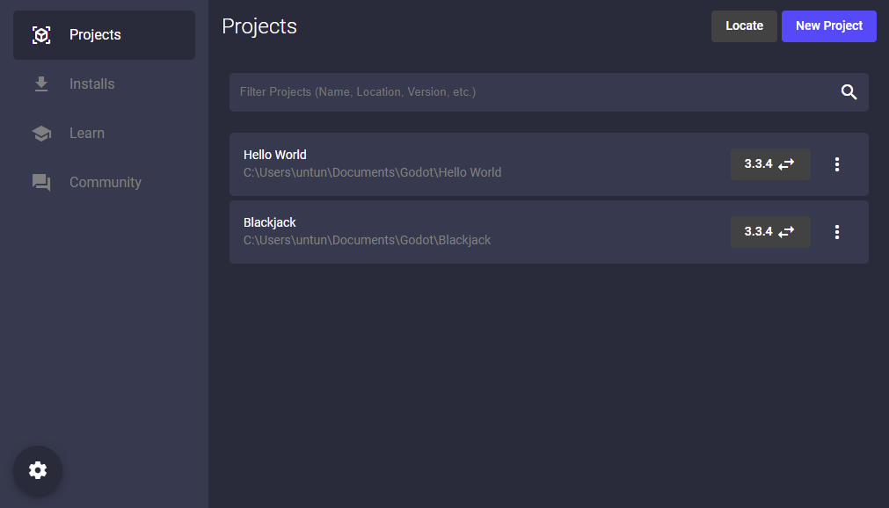

# Godot Hub

**Note:** Currently there isn't a native application, and needs to be run through the command line. The application will come in due time.

Godot Hub gives the ability to:
* Manage Godot installs
* Manage Godot projects



## Prerequisites

These applications are required to download and execute the application. It is recommended to install the latest versions of each, especially Nodejs and NPM.

* [Git](https://git-scm.com/) &ndash; Used to clone Godot Hub from Github.
* [Nodejs](https://nodejs.org/en/) &ndash; Required to run the application.
* [NPM](https://www.npmjs.com/) &ndash; Required to download the modules for the application (This is shipped with node).

## Installation

This will install all the tools necessary to run the application.

```sh
$ git clone git@github.com:TheColorRed/godot-hub.git
$ npm install
```

## Startup

Once everything is installed from above, this command can be executed to start the application.

```sh
$ npm start
```